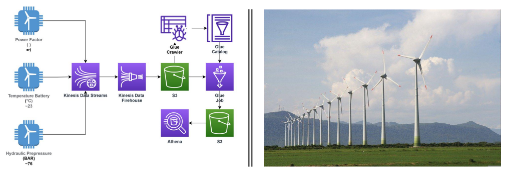

# Project 02 - Streaming de dados em sensores de turbinas eólicas.

> Coleta e armazenamento de dados a partir de um streaming de dados utilizando AWS Cloud
desde a coleta dos dados, até a visualização no AWS Athena.

## Objetivo:

> Realizar a aquisição de dados em tempo real (Streaming) de sensores instalados em uma
turbina eólica e armazenar esses dados no ambiente AWS para realizar análises e consultas
deles.

### **Roadmap**:

  - Realizar a criação dos sensores de aquisição de dados de
  [Power_Factory](encurtador.com.br/tJQ14),
  [Battery_Temperature](encurtador.com.br/uMQY3),
  [Hydraulic_Pressure](encurtador.com.br/abMY4).
  - Criar o Kinesis Data Stream para receber os dados gerados.
  - Criar o Kinesis Data Firehouse para realizar a captura e o armazenamento desses dados no
    S3.
  - Criar o bucket S3 para armazenar os dados.
  - Criar o Database no Glue para armazenar os dados após o crawler.
  - Criar o Crawler no Glue para realizar a catalogação desses dados em formato de tabela
    de um banco relacional.
  - Criar um Glue Job para poder armazenar esses novos dados catalogados em um bucket S3.
  - Utilizar o Athena para poder realizar a consulta desses dados.

## Scripts de resolução:

> Os scripts responsáveis pela geração dos dados de cada sensor podem ser encontrados aqui
[**Scripts**](encurtador.com.br/agmtW).
